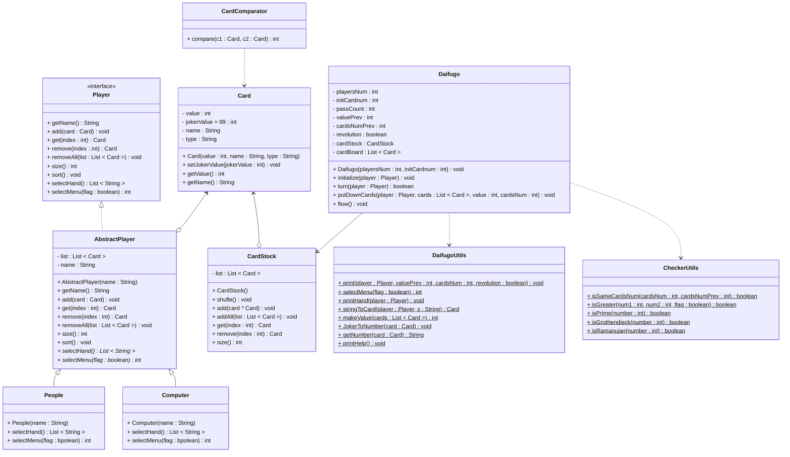

# PrimeDaifugo

## 各ファイルについて
- Card: トランプカードのクラス。Listで集約すると手札とか山札になる。
- CardStock: 山札。切ったり（shufle）、引いたり（remove）、加えたり（add）出来る。
- CardComparator: カードの大小を比較するコンパレータ。手札の整理（→Playerクラスのsortメソッド）に使う。
- CheckerUtils: 場に出たカードが有効か判定する系の関数の集まり。
- DaifugoUtils: 手札とか盤面を表示したり、カードを数字に変換したり、根幹の関数の集合。
- Daifugo: 実際に大富豪を行うオブZジェクト。ごちゃごちゃしてるので上手く関数やらオブジェクトで隠蔽できねぇかなと試行錯誤したりしなかったり。
- Main: メインとか言ってるが、実際はUI担当みたいな仲介人。大富豪をプレイするまでの初期設定とかヘルプとかを担当する。
- Player: プレイヤーに関するインタフェース。
- AbstractPlayer: プレイヤーの抽象クラス。手札（List<Card> list変数）を管理したり。行動選択をするselectMenu()と、場に出すカードを決めるselectHand()の実装が、PeopleとComputerで異なるので実クラスに任せている。
- People: プレイヤー(Player)が既に使われてしまったので、人間という名称。
- Computer: CPUのプレイヤー。機械学習かゲーム理論やら学んで対戦CPUを作れたらなという展望。

## クラス図

## 実行
適当にコンパイルして
java Main

## 展望
全部コンパイルしていちいちCUIでjava Mainして……面倒すぎるのでいつかGUI周りも漁ってJarファイル形式で手軽に配布まで行けたらいいなと思ったり。
